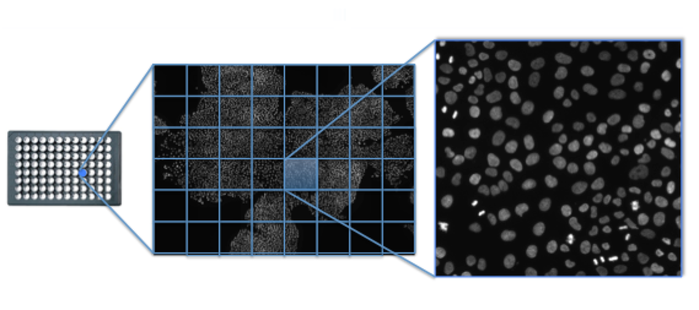

# An Integrated Image data Analysis and Machine Learning approach for high-throughput drug and genetic phenotypic screening

## Goal
The goal of this project is to develop  a prototype of an  Integrated image data analysis and machine learning  software/approach for high-throughput drug and genetic phenotypic screen. high-throughput phenotypic screening also called  high-content analysis (HCA) or cellomics, is a used in biological research and drug discovery to identify substances such as small molecules, peptides, or RNAi that alter the phenotype of a cell in a desired manner. The most common analysis involves first the labeling proteins with fluorescent tags, then  the acquisition of spatial and temporal  information by an automated microscope, and finally the measurement and analysis of the changes in cell phenotype   using an automated image analysis software. Through the use of fluorescent tags, it is possible to measure in parallel a wide range of cell components and  changes at a subcellular level 

For this prototype I  developped i) a  data image analsyis software to measure cell features related to  single cells and to cellular spatial realtionships o (e.d., cell confinement, distance and number of neighbouring cells). Furthermore to increase accurancy of the analysis and reduce noise I classified cells according to their specific spatial and biological status. In particular for this prototype as a proof of concept I determine whether a cells has free cell-cell contact edges and whther is a deviding cell. The cell-cell free edge is an important informa as many molecular signals and cellular biologicla processes are inbibited when cells are confluent and confined. The classification was performed by classical machine learning approaches in particular by using logistic regression and a small neural network (deep learning). Other methods line ... were also tested .

This project was diveded in the four sub-projects describe below (the code is arranged in the corresponding four folders): 

- Image segmentation by voronoi tasselletion  
- Data/features extraction from  tassellated images
- Data managment (e.g., storage, clean up , normalization)
- Classification 

## Image segmentation by voronoi tassellation

The goal of this part of the project is to divide an image acquisition in cellular unit so that we can calculate the data features for the single cells in the entire cell population. In particularr to determine the cellular units wI used a tassellation voronoi diagram (see picture below) on the cell nuclei.  the voronoi diagram is built from a set of points, called seeds, sites or generators, in this project the seeds are the nuclei centrois and for each seed is determned  a corresponding region consisting of all points closer to that seed than to any other. In other words the  regions of a voronoi diagrma , also called Voronoi cells or tassells , are a measure of how close the seed/nucleus of that region is to its neighbours seeds/nuclei. In terms of biology the single tassels of a voronoi diagram gives a mearumented of he level of cell confinement or contact inhibition, which is know to affect many cellular phenotypic effect: proliferation, apoptosis, cell signaling etc. This type of information might be critical to increase the accurancy for example of a drug or genetic screen which has as readout for example the cell proliferation. 

The advantage of using this spefic tassellation algorithm is also given by the 
For image segmentation I used High-content  

## Data/features extraction from  tassellated images

## Data managment (e.g., storage, clean up , normalization)

## Machine Learning Classification

## Data Analyis

## Image data analysis

high-content analysis (HCA) or cellomics, is a used in biological research and drug discovery to identify substances such as small molecules, peptides, or RNAi that alter the phenotype of a cell in a desired manner. In particular cells are first exposed to  the substance  and after a period of time, structures and molecular components of the cells are analyzed. The most common analysis involves labeling proteins with fluorescent tags, and finally changes in cell phenotype are measured using automated image analysis. Through the use of fluorescent tags, it is possible to measure in parallel several different cell components and cellular changes at a subcellular level (e.g., cytoplasm vs. nucleus vs. other organelles). Therefore a large number of data points can be collected per cell. In addition to fluorescent labeling, various label free assays have been used in high content screening

For my toy project I will use high content images acquisition of cells labelled with DNA and other protein markers.  
1. Image acquisition, preparation (change name), remove background, etc.... To use images from High content acquisition fo whole slide.
   For the whole slide acquisition I will use OpenSlide library to devide a big acquired area in tails at different magnification.
   

2. Image segmentation to measure the features related to single cells and and multiple cells in different contexts (mitotic cells, cells at the edge, intercellular distance, cellur compaction, neighbouring cells, etc...). I use tassellation of the entire cell population from nuclear segmentation. I use a KD-tree data structure to have an efficient retrieval (log) and spatial retivial of the  the segmented tassellation (voronoi diagram)  

3. measurement of the features , the number of features will be measured from single segmented tassell and contained nuclear segmentation. the data are stored in an SQL database. The feature calculated for a single tassel are:

a. 
b.
c. 

3. Data managment.  clean data, logical organization,  normalization, rescaling  etc

4. machine learning for classification of the tassels in different categories
a. mitotic cells 
b. cells at the edges
c. apoptotic cells  (to do)

The classification task depends on the specific experiment. In this Toy project I will determine hte mitotic cells and cells at the edges. In the first case I will use a neural network and in the second case a logistic regression algorithm. 
The implementation will be done in matlab 

Bias analysis and variance 

validation

4. data analysis and results

To measure the sigle cell features in a large group of screened cells I first segmented the cell nuclei used a tassellation algorithm (i.e., voronoi and ...)

Cellular nuclear marker are widely used to identify ... (show picture)

plot((1:100))
